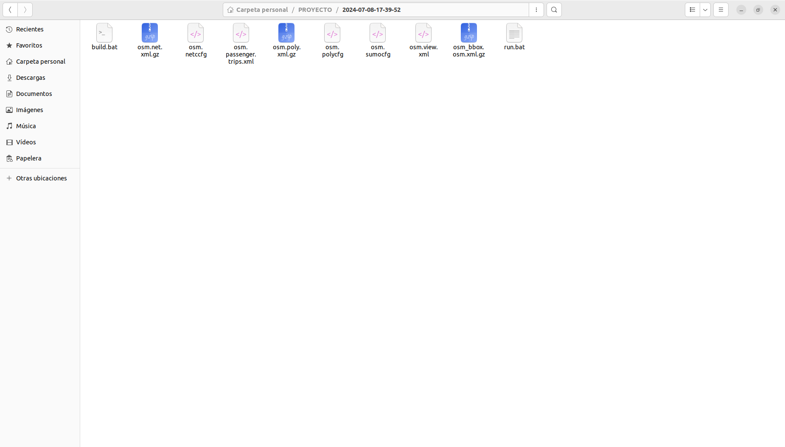
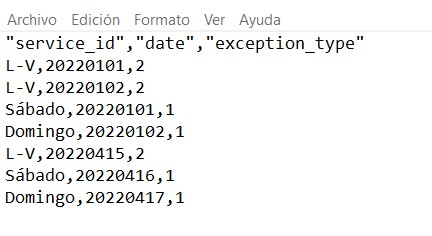
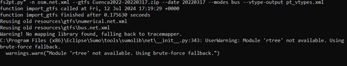
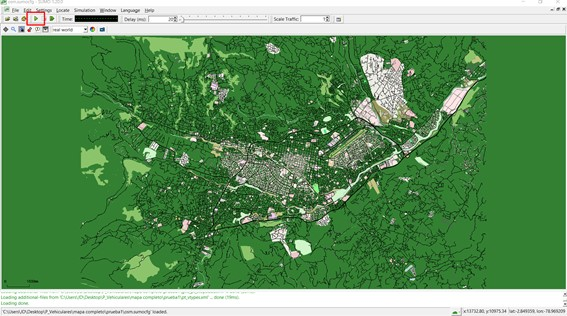

# GTFS with SUMO
En el presente repositorio se hara una breve descripcion de lo que es el trabajar con los archivos GTFS al mismo tiempo que con sumo, para lo cual se hara una descripcion desde cero.Entoces se empieza con los siguientes pasos:

## Generar Archivo de la Ciudad de Cuenca
Para este paso se uso la herramienta que se encuentran incluido en SUMO el cual es el osmWebwizard para lo cual se tiene que escribir el siguiente comando:
````
python3 /rutadesumo/tools/osmWebWizard.py 
````
En la cual se selecciono el mapa de Cuenca, Ecuador como se muestra en la imagen 


En este punto se tiene que tener en cuenta que no se generara ningun trafico ni tampooco se considerara de vias maritimas, ni de trenes por lo que se tiene que especifficar en la misma pagina de google chrome que no se desea estas rutas y se tiene que deseleccionar todas estas opciones, una vez realizado este paso vamos a ver que se nos abre una pestaña en el sumo-gui la cual cerramos, y tendremos una carpeta con todos los archivos necesarios para una simulacion en SUMO, como la podemos observar en la siguiente imagen



Una vez obtenido los archivos se tiene que tener el archivo GTFS de la ciudad que deseamos ya que en el mismo se encuentran todas las especificaciones de cada bus, para el mismo tambien se necesita que el archivo GTFS contenga todos los campos que constan en  un archivo GTFS los cuales son:

1. **agency.txt**
   - **Descripción:** Contiene información sobre una o más agencias de transporte que operan el sistema de transporte público.
   - **Columnas principales:** `agency_id`, `agency_name`, `agency_url`, `agency_timezone`, `agency_lang`, `agency_phone`, `agency_fare_url`

2. **stops.txt**
   - **Descripción:** Contiene información sobre las ubicaciones donde los vehículos de transporte recogen o dejan pasajeros.
   - **Columnas principales:** `stop_id`, `stop_code`, `stop_name`, `stop_desc`, `stop_lat`, `stop_lon`, `zone_id`, `stop_url`

3. **routes.txt**
   - **Descripción:** Contiene información sobre las rutas de transporte público.
   - **Columnas principales:** `route_id`, `agency_id`, `route_short_name`, `route_long_name`, `route_desc`, `route_type`, `route_url`, `route_color`, `route_text_color`

4. **trips.txt**
   - **Descripción:** Contiene información sobre los viajes de transporte público para cada ruta.
   - **Columnas principales:** `route_id`, `service_id`, `trip_id`, `trip_headsign`, `trip_short_name`, `direction_id`, `block_id`, `shape_id`

5. **stop_times.txt**
   - **Descripción:** Contiene información sobre las horas de llegada y salida de cada parada para cada viaje.
   - **Columnas principales:** `trip_id`, `arrival_time`, `departure_time`, `stop_id`, `stop_sequence`, `stop_headsign`, `pickup_type`, `drop_off_type`, `shape_dist_traveled`

6. **calendar.txt**
   - **Descripción:** Contiene información sobre los días de servicio de transporte público.
   - **Columnas principales:** `service_id`, `monday`, `tuesday`, `wednesday`, `thursday`, `friday`, `saturday`, `sunday`, `start_date`, `end_date`

7. **calendar_dates.txt**
   - **Descripción:** Contiene excepciones al calendario de servicio especificado en `calendar.txt`.
   - **Columnas principales:** `service_id`, `date`, `exception_type`

8. **fare_attributes.txt** (opcional)
   - **Descripción:** Contiene información sobre las tarifas de transporte público.
   - **Columnas principales:** `fare_id`, `price`, `currency_type`, `payment_method`, `transfers`, `agency_id`

9. **fare_rules.txt** (opcional)
   - **Descripción:** Contiene información sobre las reglas de tarifas para las rutas.
   - **Columnas principales:** `fare_id`, `route_id`, `origin_id`, `destination_id`, `contains_id`

10. **shapes.txt** (opcional)
    - **Descripción:** Contiene información sobre las rutas geométricas que toman los vehículos.
    - **Columnas principales:** `shape_id`, `shape_pt_lat`, `shape_pt_lon`, `shape_pt_sequence`, `shape_dist_traveled`

11. **frequencies.txt** (opcional)
    - **Descripción:** Contiene información sobre la frecuencia de los servicios en determinadas horas del día.
    - **Columnas principales:** `trip_id`, `start_time`, `end_time`, `headway_secs`

12. **transfers.txt** (opcional)
    - **Descripción:** Contiene información sobre las transferencias entre rutas.
    - **Columnas principales:** `from_stop_id`, `to_stop_id`, `transfer_type`, `min_transfer_time`

13. **feed_info.txt** (opcional)
    - **Descripción:** Contiene información adicional sobre el feed GTFS.
    - **Columnas principales:** `feed_publisher_name`, `feed_publisher_url`, `feed_lang`, `feed_start_date`, `feed_end_date`, `feed_version`

Aquí puedes descargar el archivo GTFS utilizado en este proyecto:

[Descargar GTFS](data/Cuenca2022-20220317%20.zip)

Se tiene que acotar que como se menciono anteriormente se necesita del archivo calendar dates el cual para el presente proyecto se lo tuvo que modificar de añadiendo los campos que se ven en la imagen:





En donde se deben agregar por lo menos un servicio, en la primera columna va el id del servicio, en la segunda va la fecha que queremos agregar al calendario, en la tercera fila si queremos excluir (2) o agregar (1), ejemplo:

Se tiene que el día 1 de enero del 2022 como es día festivo los buses trabajan en horario de fin de semana por lo que se excluye el horario normal y se agrega el horario de l sábado como ejemplo:

L-V,20220101,2:excluyendo horario normal

Sabado,20220101,1:añade horario de un día sábado


Una vez se completo con los archivos necesarios para convertir los archivos GTFS se procede con el uso de otro codigo que contiene SUMO el cual es gtfs2pt.py
`````
python tools/import/gtfs/gtfs2pt.py -n osm.net.xml --gtfs Cuenca2022-20220317%20.zip --date 20230904 --modes bus --vtype-output pt_vtypes.xml

`````
cuando iniciamos con la ejecucion del codigo nos apareceran la siguiente informacion:



La cual como podemos observar nos da un warning donde no encuentra el modulo tracermapo, pero este buscara otros modulos para realizar la ejecucion del codigo por lo que se tiene que ser paciente, una vez el codigo se ejecuto de manera correcta se generan 2 archivos aprte del v_types los cuales son:

[Descargar stops](data/gtfs_pt_stops.add.xml)

[Descargar vehicles](data/gtfs_pt_vehicles.add.xml)

Estos dos archivos contienen toda la informacion necesaria de lo que consta en el archivo GTFS se tiene que tener en cuenta que estos 2 archivos son realizados con cierto mapa de la zona de cuenca ya que si se necesita que esten absolutamente todos los buses de la ciudad de cuenca el mapa que se tiene que exportar debe ser mucho mas grande ademas de constar con todos los lugares en los que los buses lleguen.

## Generacion de trafico en el mapa

Para esta seccion es bastante ,as simple ya que a la par de los anteriores solo usamos el codigo que se encuentra en uno de los archivos de SUMO mismo el archivo python es randomtrips.py
````
python3 /opt/sumo/tools/randomTrips.py -v -b 0 -e TIEMPO -p VAR -n osm.net.xml -r randomvehicles.rou.xml
````
En TIEMPO se coloca la cantidad de tiempo en segundos que se va ha generar el tráfico. El parámetro VAR se calcula como VAR=TIEMPO/Num_Vehiculos.

-	El tiempo  que se demore en generar el tráfico dependerá de los vehículos que se quiera simular, finalizara creando el archivo randomvehicles.rou.xml.
-	Ahora los archivos se deben colocar en l archivo sumo.conf como se muestra en el mismo archivo del repositorio el cual es [sumo conf](data/osm.sumocfg).

Tambien al mismo archivo mencionado se agregaron campos de output para al final de la simulacion recolectar los datos del CO2 de las rutas del tiempo y de las distancias que recorre cada autobus.



En la imagen se muestra la simulacion adecuada del codigo pero en caso de querer que la misma sea de manera  mas rapida lo unico que se tiene que realizar es  por medio de un comando el cual ejecuta el sumo config el comando es el siguiente:

`````
sumo -v -c osm.sumocfg
`````

al finalizar nos dara los outputs solicitados ademas de lo que seria un recuento de los automoviles de la simulacion entre otros.

