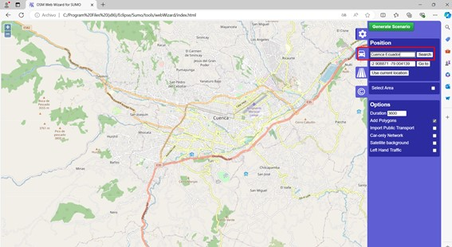

# GTFS with SUMO
En el presente repositorio se hara una breve descripcion de lo que es el trabajar con los archivos GTFS al mismo tiempo que con sumo, para lo cual se hara una descripcion desde cero.Entoces se empieza con los siguientes pasos:

## Generar Archivo de la Ciudad de Cuenca
Para este paso se uso la herramienta que se encuentran incluido en SUMO el cual es el osmWebwizard para lo cual se tiene que escribir el siguiente comando:
````
python3 /rutadesumo/tools/osmWebWizard.py 
````
En la cual se selecciono el mapa de Cuenca, Ecuador como se muestra en la imagen 



En este punto se tiene que tener en cuenta que no se generara ningun trafico ni tampooco se considerara de vias maritimas, ni de trenes por lo que se tiene que especifficar en la misma pagina de google chrome que no se desea estas rutas y se tiene que deseleccionar todas estas opciones, una vez realizado este paso vamos a ver que se nos abre una pestaña en el sumo-gui la cual cerramos, y tendremos una carpeta con todos los archivos necesarios para una simulacion en SUMO, como la podemos observar en la siguiente imagen